# PROSPECTIVE — Plataforma de Planificación Preoperatoria de Aneurismas Cerebrales

> **Versión:** 0.1.0 · **Python:** ≥ 3.11 · **Licencia:** UniNavarra

PROSPECTIVE es una aplicación de escritorio (PyQt5 + VTK) para la planificación preoperatoria del tratamiento endovascular y quirúrgico de aneurismas cerebrales. Integra carga DICOM, segmentación 3D, análisis morfométrico, detección de candidatos y planificación de dispositivos (clips y stents/desviadores de flujo) en un entorno clínico unificado.

---

## Tabla de contenidos

- [PROSPECTIVE — Plataforma de Planificación Preoperatoria de Aneurismas Cerebrales](#prospective--plataforma-de-planificación-preoperatoria-de-aneurismas-cerebrales)
  - [Tabla de contenidos](#tabla-de-contenidos)
  - [1. Requisitos e instalación](#1-requisitos-e-instalación)
    - [Prerrequisitos del sistema](#prerrequisitos-del-sistema)
    - [Instalación](#instalación)
  - [2. Arranque de la aplicación](#2-arranque-de-la-aplicación)
  - [3. Arquitectura general](#3-arquitectura-general)
  - [4. Flujo de usuario](#4-flujo-de-usuario)
  - [5. Módulos y funcionalidades](#5-módulos-y-funcionalidades)
    - [5.1 Autenticación y gestión de usuarios](#51-autenticación-y-gestión-de-usuarios)
    - [5.2 Gestión de pacientes y estudios](#52-gestión-de-pacientes-y-estudios)
    - [5.3 Carga y visualización DICOM](#53-carga-y-visualización-dicom)
    - [5.4 Segmentación vascular 3D](#54-segmentación-vascular-3d)
    - [5.5 Detección automática de candidatos](#55-detección-automática-de-candidatos)
    - [5.6 Análisis morfométrico](#56-análisis-morfométrico)
      - [Métricas calculadas](#métricas-calculadas)
      - [Etiqueta de riesgo heurística](#etiqueta-de-riesgo-heurística)
    - [5.7 Puntuación PHASES](#57-puntuación-phases)
      - [Factores y puntuaciones](#factores-y-puntuaciones)
      - [Tabla de riesgo a 5 años](#tabla-de-riesgo-a-5-años)
    - [5.8 Ventana de planificación 3D](#58-ventana-de-planificación-3d)
      - [Controles de cámara](#controles-de-cámara)
      - [Modos de interacción](#modos-de-interacción)
      - [Toolbar superior](#toolbar-superior)
      - [Trayectoria de picks](#trayectoria-de-picks)
    - [5.9 Planificación de clips](#59-planificación-de-clips)
      - [Catálogo de clips](#catálogo-de-clips)
      - [Colocación de clips](#colocación-de-clips)
      - [Convención del sistema de referencia del clip](#convención-del-sistema-de-referencia-del-clip)
      - [Verificación de colisiones](#verificación-de-colisiones)
      - [Marcado de arterias perforantes](#marcado-de-arterias-perforantes)
      - [Gestión de clips colocados](#gestión-de-clips-colocados)
    - [5.10 Planificación de stents y desviadores de flujo](#510-planificación-de-stents-y-desviadores-de-flujo)
      - [Colocación de stents](#colocación-de-stents)
      - [Visualización de viabilidad](#visualización-de-viabilidad)
      - [Modo deformación](#modo-deformación)
      - [Importación de dispositivos personalizados](#importación-de-dispositivos-personalizados)
      - [Gestión de stents colocados](#gestión-de-stents-colocados)
    - [5.11 Sizing asistido de desviador de flujo](#511-sizing-asistido-de-desviador-de-flujo)
      - [Inputs](#inputs)
      - [Algoritmo de sizing](#algoritmo-de-sizing)
      - [Código de colores de resultados](#código-de-colores-de-resultados)
      - [Botón "Aplicar mejor opción"](#botón-aplicar-mejor-opción)
    - [5.12 Visualizador MPR](#512-visualizador-mpr)
    - [5.13 Generación de informes](#513-generación-de-informes)
    - [5.14 Exportación de sesiones y mallas](#514-exportación-de-sesiones-y-mallas)
  - [6. Catálogos de dispositivos](#6-catálogos-de-dispositivos)
    - [6.1 Clips](#61-clips)
      - [Formas disponibles](#formas-disponibles)
      - [Fabricantes incluidos](#fabricantes-incluidos)
    - [6.2 Stents y desviadores de flujo](#62-stents-y-desviadores-de-flujo)
      - [Desviadores de flujo (`FLOW_DIVERTER`)](#desviadores-de-flujo-flow_diverter)
      - [Stents de coiling asistido (`INTRACRANIAL`)](#stents-de-coiling-asistido-intracranial)
  - [7. Estructura de directorios](#7-estructura-de-directorios)
  - [8. Dependencias](#8-dependencias)
  - [9. Tests](#9-tests)
  - [10. Registro de cambios](#10-registro-de-cambios)
    - [\[F-01\] Carga DICOM y renderizado volumétrico](#f-01-carga-dicom-y-renderizado-volumétrico)
    - [\[F-02\] Segmentación vascular interactiva](#f-02-segmentación-vascular-interactiva)
    - [\[F-03\] Análisis morfométrico completo](#f-03-análisis-morfométrico-completo)
    - [\[F-04\] Planificación de clips](#f-04-planificación-de-clips)
    - [\[A-03-10\] Módulos de riesgo complementarios](#a-03-10-módulos-de-riesgo-complementarios)
    - [\[A-04-03\] Detección de colisiones clip–perforante](#a-04-03-detección-de-colisiones-clipperforante)
    - [\[PHASES\] Calculadora de puntuación PHASES](#phases-calculadora-de-puntuación-phases)
    - [\[TRAY-CLIP\] Colocación de clips por trayectoria](#tray-clip-colocación-de-clips-por-trayectoria)
    - [\[SIZING-FD\] Sizing asistido de desviador de flujo *(Sim\&Cure-inspired)*](#sizing-fd-sizing-asistido-de-desviador-de-flujo-simcure-inspired)

---

## 1. Requisitos e instalación

### Prerrequisitos del sistema
- Python **3.11** o superior
- Sistema operativo: Windows 10/11 (principal), Linux/macOS (compatible)
- RAM recomendada: ≥ 8 GB (renderizado VTK volumétrico)
- GPU: cualquier tarjeta compatible con OpenGL 3.2+

### Instalación

```bash
# 1. Clonar o descomprimir el proyecto
cd Prospective/

# 2. Crear entorno virtual (recomendado)
python -m venv .venv
.venv\Scripts\activate          # Windows
# source .venv/bin/activate     # Linux/macOS

# 3. Instalar dependencias
pip install -r requirements.txt
```

---

## 2. Arranque de la aplicación

```bash
python main.py
```

Al iniciar por primera vez, se presenta un **asistente de creación de cuenta administradora**. En los inicios siguientes se muestra el diálogo de login estándar.

---

## 3. Arquitectura general

```
main.py
└── prospective/app.py              ← QApplication, logging, singletons, flujo de arranque
    ├── auth/                       ← Autenticación PBKDF2-HMAC-SHA256
    ├── audit/skull_chain.py        ← Cadena de auditoría inmutable (hash-chain)
    ├── db/                         ← Base de datos SQLite (SQLAlchemy ORM)
    │   ├── models.py               ← Patient / Study / PlanningSession / User
    │   └── database.py             ← DatabaseManager singleton + auto-migraciones
    ├── dicom/                      ← Carga y preprocesado de series DICOM
    ├── processing/                 ← Segmentación, morfometría, detección, colisiones
    ├── models/                     ← Catálogos de dispositivos (sin dependencias UI)
    ├── rendering/                  ← Actores VTK (clip, stent, funciones de transferencia)
    ├── io/                         ← Exportación (sesión JSON, PDF, DICOM SR, mallas)
    └── ui/
        ├── main_window.py          ← QMainWindow con dockwidgets (planificación activa)
        ├── themes.py               ← Estilos QSS globales (glass / dark / light)
        ├── viewers/                ← MPR, slice 2D, volumen VTK
        ├── widgets/
        │   ├── login_dialog.py     ← Login cinematic con video de fondo
        │   ├── nuevo_caso_dialog.py← Formulario de ingreso clínico (5 secciones)
        │   ├── user_manager.py     ← Gestión de usuarios (admin)
        │   └── ...                 ← Paneles especializados (clips, stents, morfometría…)
        └── windows/
            ├── welcome_window.py   ← Pantalla principal post-login (video + nav bar)
            ├── case_dashboard.py   ← Grid de casos recientes (lazy desde WelcomeWindow)
            └── planning_window.py  ← Ventana flotante de planificación 3D
```

La aplicación sigue un patrón **señal → ranura** de Qt entre paneles. El `MainWindow` actúa como bus central: recibe señales de cada panel y las reenvía a los destinos correspondientes (MPR, ventana de planificación, informe).

### Patrón de ciclo de vida de ventanas

```
app.setQuitOnLastWindowClosed(False)   ← evita cierre al ocultar WelcomeWindow
welcome.destroyed → app.quit          ← único punto de cierre real

WelcomeWindow (siempre visible excepto cuando MainWindow está abierto)
  ├── hide()  →  MainWindow.show()    (WelcomeWindow se oculta, no se cierra)
  └── show()  ←  MainWindow.destroyed (WelcomeWindow vuelve al frente)

CaseDashboard creado lazy en primer clic "CASOS EXISTENTES":
  signals conectados ANTES de show() → no hay race condition
```

### Sistema de temas — Oscuro y Claro

La aplicación soporta dos temas visuales completos conmutables en tiempo de ejecución, gestionados desde `prospective/ui/themes.py`.

**Tres capas de aplicación de estilos:**

1. **QSS global** — `app.setStyleSheet()` en `themes.py` cubre todos los widgets estándar de Qt.
2. **Tokens de color por tema** — usados en el QSS global y en los estilos inline:

   | Token | Oscuro | Claro |
   |---|---|---|
   | `bg` | `#1F1F1F` | `#F4F7FA` |
   | `card` | `#2A2A2A` | `#F7F7F7` |
   | `border` | `#363636` | `#E5E5E5` |
   | `txt` | `#EBEBEB` | `#0D0D0D` |
   | `success` | `#3fb950` | `#3fb950` |
   | `error` | `#f85149` | `#f85149` |
   | `warning` | `#e3b341` | `#e3b341` |

3. **Estilos inline adaptativos** — Los widgets con estilos personalizados (`setStyleSheet()` a nivel de widget) usan el patrón `_is_dark()` para seleccionar los colores correctos en cada tema:

   ```python
   def _is_dark() -> bool:
       try:
           from prospective.ui.themes import is_dark   # lazy: evita ciclos de importación
           return is_dark()
       except Exception:
           return True   # fallback seguro al tema oscuro
   ```

**Contextos intencionalmente siempre oscuros** (sin adaptación de tema — estándar clínico / cinematográfico):
- `LoginDialog` / pantalla de primer uso — overlay cinematográfico sobre video quirúrgico
- `WelcomeWindow` — barra de navegación semitransparente sobre video en bucle
- `slice_widget` / `cross_plane_dialog` — visores DICOM (fondo negro, estándar en imagenología médica)

---

## 4. Flujo de usuario

```mermaid
flowchart TD

%% ── INICIO ──────────────────────────────────────────────────────────────
    START([Iniciar aplicación\npython main.py])
    START --> AUTH

%% ── AUTENTICACIÓN ───────────────────────────────────────────────────────
    subgraph AUTH ["🔐  Autenticación"]
        direction TB
        A1{¿Primer uso?}
        A2[Asistente:\ncreación cuenta admin]
        A3[LoginDialog\nusuario / contraseña\nvideo de fondo]
        A1 -->|Sí| A2 --> A3
        A1 -->|No| A3
    end
    AUTH --> WELCOME

%% ── WELCOME ─────────────────────────────────────────────────────────────
    subgraph WELCOME ["🏠  WelcomeWindow — pantalla principal"]
        direction TB
        W1[Video quirúrgico en bucle\nbarra de navegación superior]
        W2{Acción del usuario}
        W3[CASO NUEVO\n→ NuevoCasoDialog]
        W4[CASOS EXISTENTES\n→ CaseDashboard]
        W5[3D → MainWindow activo\no seleccionar caso]
        W6[NOSOTROS / PQRS\nAbout / formulario contacto]
        W7[SKULLCLOUD / AR/VR / ANALITICA\nPróximamente]
        W8[My ▼ → Cerrar sesión]
        W1 --> W2
        W2 --> W3
        W2 --> W4
        W2 --> W5
        W2 --> W6
        W2 --> W7
        W2 --> W8
    end
    WELCOME --> PAT

%% ── PACIENTE ────────────────────────────────────────────────────────────
    subgraph PAT ["👤  Gestión de caso clínico"]
        direction TB
        P1{¿Nuevo caso o\nexistente?}
        P2["NuevoCasoDialog\n5 secciones:\n1. Datos paciente\n2. Antecedentes\n3. Datos clínicos\n4. Caracterización\n5. Imágenes (4 modalidades)"]
        P3[CaseDashboard\nseleccionar caso de la lista]
        P4{¿Cargar sesión\nprevia?}
        P5[Abrir .prospective\n→ restaurar estado]
        P1 -->|Nuevo| P2
        P1 -->|Existente| P3
        P2 --> P6[Cargar DICOM\nTAC / Angio / RM / Pangio]
        P3 --> P4
        P4 -->|Sí| P5
        P4 -->|No| P6
    end

%% ── IMAGEN ──────────────────────────────────────────────────────────────
    subgraph IMG ["🩻  Visualización DICOM"]
        direction TB
        I1[Renderizado volumétrico 3D\nVTK ray-casting]
        I2[MPR: Axial / Coronal / Sagital]
        I3[Ajustar preset de ventana HU\nAngio · Cerebro · Hueso]
        I1 --- I2 --- I3
    end
    P6 --> IMG
    P5 --> IMG

%% ── SEGMENTACIÓN ────────────────────────────────────────────────────────
    subgraph SEG ["✂️  Segmentación vascular"]
        direction TB
        S1[Ajustar umbral HU]
        S2[Marching Cubes\n→ malla ISO]
        S3[Suavizado Windowed Sinc\n+ Decimación Quadric]
        S4{¿Calidad\naceptable?}
        S5[Exportar malla STL / OBJ\nopcional]
        S1 --> S2 --> S3 --> S4
        S4 -->|No| S1
        S4 -->|Sí| S5
    end
    IMG --> SEG

%% ── DETECCIÓN ───────────────────────────────────────────────────────────
    subgraph DET ["🔍  Detección de candidatos"]
        direction TB
        D1[Ejecutar detector automático\ncurvatura media]
        D2[Revisar tabla de candidatos\nordenada por score]
        D3[Seleccionar candidato\n→ aislar aneurisma]
        D1 --> D2 --> D3
    end
    SEG --> DET

%% ── MORFOMETRÍA ─────────────────────────────────────────────────────────
    subgraph MORFO ["📐  Análisis morfométrico"]
        direction TB
        M1[Ejecutar análisis automático\nDNR · AR · BF · UI · EI · NSI]
        M2[Introducir Ø arteria madre\n→ calcular SR]
        M3[Ver etiqueta de riesgo\nBajo / Moderado / Alto]
        M4[Panel PHASES:\nintroducir factores clínicos]
        M5[Ver puntuación PHASES\ny riesgo a 5 años]
        M1 --> M2 --> M3
        M3 --> M4 --> M5
    end
    DET --> MORFO

%% ── PLANIFICACIÓN ───────────────────────────────────────────────────────
    MORFO --> PLAN_WIN[Abrir ventana\nde planificación 3D]

    subgraph PLAN ["🔬  Ventana de planificación 3D"]
        direction TB

        subgraph BOX ["✂ Box Clip  —  exploración anatómica"]
            direction LR
            BC1[Activar corte de caja]
            BC2[Arrastrar asas del cubo\no editar spinboxes X/Y/Z]
            BC3[Ver corte en tiempo real\ncontorno fantasma de referencia]
            BC4[Desactivar → malla completa]
            BC1 --> BC2 --> BC3 --> BC4
        end

        subgraph CLIPS ["📎  Planificación de clips"]
            direction TB
            CL1{Modo de\ncolocación}
            CL2[Manual:\nspinboxes posición/orientación]
            CL3[Trayectoria:\nmarcar puntos 📍 sobre arteria]
            CL4[Colocar clip en cuello 📌]
            CL5[Verificar colisiones\nclip-vaso + clip-perforante]
            CL6{¿Colisión\ndetectada?}
            CL7[Ajustar posición]
            CL8[Marcar perforantes 🔴\nopcional]
            CL9[Exportar plan CSV]
            CL1 -->|Manual| CL2 --> CL5
            CL1 -->|Trayectoria| CL3 --> CL4 --> CL5
            CL5 --> CL6
            CL6 -->|Sí| CL7 --> CL5
            CL6 -->|No| CL8 --> CL9
        end

        subgraph STENTS ["🩺  Planificación de stents / FD"]
            direction TB
            ST1[Sizing asistido:\nintroducir Ø prox · Ø dist · cuello]
            ST2[Calcular recomendaciones\n✓ óptimo  ~ aceptable  ! ajustado]
            ST3[Aplicar mejor opción\n→ preselecciona en catálogo]
            ST4{Modo de\ncolocación}
            ST5[Trayectoria:\nautocolocación con viabilidad\nverde · naranja · rojo]
            ST6[Manual:\nspinboxes + catálogo]
            ST7[Redefinir forma si necesario]
            ST8[Exportar plan CSV]
            ST1 --> ST2 --> ST3 --> ST4
            ST4 -->|Trayectoria| ST5 --> ST7
            ST4 -->|Manual| ST6 --> ST7
            ST7 --> ST8
        end

        BOX ~~~ CLIPS
        CLIPS ~~~ STENTS
    end

    PLAN_WIN --> PLAN

%% ── INFORME ─────────────────────────────────────────────────────────────
    subgraph REP ["📄  Informe y exportación"]
        direction TB
        R1[Completar datos del paciente]
        R2[Generar informe PDF\ncon screenshot 3D + métricas]
        R3[Exportar DICOM SR\nopcional]
        R4[Guardar sesión .prospective]
        R1 --> R2 --> R3 --> R4
    end
    PLAN --> REP

    REP --> END{¿Otra sesión\no paciente?}
    END -->|Sí| PAT
    END -->|No| LOGOUT([Cerrar / Logout])

%% ── ESTILOS ─────────────────────────────────────────────────────────────
    classDef startEnd  fill:#1f3a5f,stroke:#58a6ff,color:#c9d1d9,font-weight:bold
    classDef decision  fill:#2d1b00,stroke:#e3b341,color:#e3b341
    classDef process   fill:#0d1117,stroke:#30363d,color:#c9d1d9
    classDef subproc   fill:#111820,stroke:#21262d,color:#8b949e

    class START,LOGOUT startEnd
    class A1,P1,P4,S4,CL1,CL6,ST4,END decision
```



### Descripción de cada etapa

| # | Etapa | Panel / Ventana | Resultado |
|---|---|---|---|
| 1 | **Autenticación** | `LoginDialog` (video cinematic) | Usuario autenticado con rol |
| 2 | **Home** | `WelcomeWindow` (video + nav bar) | Acceso a todos los módulos |
| 3 | **Ingreso de caso** | `NuevoCasoDialog` (5 secciones) | Patient + Study creados en BD; DICOM(s) vinculados |
| 4 | **Casos existentes** | `CaseDashboard` (grid lazy) | Caso o sesión seleccionada |
| 5 | **DICOM** | `VtkVolumeWidget` + MPR | Volumen cargado, ventana HU ajustada |
| 6 | **Segmentación** | `SegmentationPanel` | Malla vascular `.stl` lista |
| 7 | **Detección** | `AneurysmPanel` | Candidato aislado como `vtkPolyData` |
| 8 | **Morfometría** | `MorphometricsPanel` | DNR, AR, BF, UI, EI, NSI, SR + riesgo heurístico |
| 9 | **PHASES** | `PHASESPanel` (embebido) | Puntuación 0–13 + riesgo 5 años |
| 10 | **Box Clip** | `PlanningWindow` — dock izquierdo | Exploración interior del vaso antes de planificar |
| 11 | **Clips** | `ClipPanel` | Clips colocados, colisiones verificadas, CSV exportado |
| 12 | **Stents / FD** | `StentPanel` + sizing asistido | Dispositivos colocados con viabilidad confirmada, CSV exportado |
| 13 | **Informe** | `ReportPanel` | PDF clínico + DICOM SR + sesión `.prospective` guardada |

---

## 5. Módulos y funcionalidades

### 5.1 Autenticación y gestión de usuarios

**Archivos:** `prospective/auth/auth_manager.py` · `prospective/ui/widgets/login_dialog.py` · `prospective/ui/widgets/user_manager.py`

| Funcionalidad | Descripción |
|---|---|
| Primer arranque | Asistente para crear cuenta administradora local |
| Login | Diálogo usuario/contraseña con validación PBKDF2-HMAC-SHA256 (260 000 iteraciones, conforme NIST SP 800-63B) |
| Roles | `admin` (acceso total) y `viewer` (solo lectura) |
| Gestión de usuarios | Panel exclusivo para administradores: crear, editar y desactivar cuentas |

**Acceso:** Menú → *Administración → Gestionar usuarios* (solo administradores)

---

### 5.2 Gestión de pacientes y estudios

**Archivos:** `prospective/ui/widgets/patient_manager.py` · `prospective/db/`

| Funcionalidad | Descripción |
|---|---|
| Lista de pacientes | Búsqueda por nombre/ID, ordenación, CRUD completo |
| Estudios por paciente | Asocia series DICOM a cada paciente |
| Sesiones de planificación | Guarda y recupera sesiones previas por paciente |
| Base de datos | SQLite local gestionada con SQLAlchemy ORM |

**Acceso:** Menú → *Pacientes*

---

### 5.3 Carga y visualización DICOM

**Archivos:** `prospective/dicom/` · `prospective/ui/viewers/`

| Funcionalidad | Descripción |
|---|---|
| Carga de series | Lectura de carpetas DICOM con pydicom + SimpleITK |
| Metadatos | Extracción automática: paciente, fecha, modalidad, voxel spacing |
| Presets de ventana | HU presets: Angio, Cerebro, Hueso (configurables en `utils/window_presets.py`) |
| Renderizado volumétrico | VTK ray-casting con funciones de transferencia personalizadas |
| Vistas MPR | Axial, Coronal, Sagital sincronizadas con crosshair 2D |

**Acceso:** Menú → *Archivo → Cargar DICOM*

---

### 5.4 Segmentación vascular 3D

**Archivos:** `prospective/processing/segmentation.py` · `prospective/ui/widgets/segmentation_panel.py`

| Funcionalidad | Descripción |
|---|---|
| Umbral interactivo | Slider HU para elegir isosuperficie vascular |
| Marching Cubes | Extracción de malla ISO con VTK |
| Suavizado | Windowed Sinc filter (preserva volumen) |
| Decimación | Quadric decimation con ratio configurable |
| Normales | Cálculo automático para renderizado correcto |
| Exportación | STL / OBJ / VTK desde el panel |

**Pipeline completo:**
```
Gaussian smoothing → Marching Cubes → Windowed Sinc → Quadric decimation → Normales
```

**Acceso:** Panel lateral *Segmentación*

---

### 5.5 Detección automática de candidatos

**Archivos:** `prospective/processing/aneurysm_detector.py` · `prospective/ui/widgets/aneurysm_panel.py`

| Funcionalidad | Descripción |
|---|---|
| Curvatura media | Cálculo en cada vértice de la malla vascular |
| Umbral automático | Top-N% vértices de mayor curvatura |
| Componentes conectadas | Agrupación en regiones candidatas |
| Estimación morfológica | Radio, esfericidad y curvatura media por candidato |
| Filtro anatómico | Elimina regiones < 1 mm o > 30 mm (fuera de rango clínico) |
| Tabla interactiva | Candidatos ordenados por score, seleccionables para aislamiento |
| Exportación de malla | Exporta el aneurisma aislado como STL |

**Acceso:** Panel lateral *Candidatos* → botón *Detectar candidatos*

---

### 5.6 Análisis morfométrico

**Archivos:** `prospective/processing/morphometrics.py` · `prospective/ui/widgets/morphometrics_panel.py`

Calcula automáticamente los índices morfométricos estándar a partir de la malla del aneurisma aislado.

#### Métricas calculadas

| Métrica | Descripción | Umbral de riesgo |
|---|---|---|
| Volumen (mm³) | Volumen interior del aneurisma | — |
| Área superficial (mm²) | Área de la malla | — |
| Diámetro máximo (mm) | Mayor distancia entre puntos | — |
| Diámetro de cuello (mm) | Cuelllo de la sección mínima | — |
| Altura de domo (mm) | Distancia cuello → ápex | — |
| Diámetro equiv. esfera (mm) | `(6V/π)^(1/3)` | — |
| DNR (Dome-to-Neck Ratio) | `max_diam / neck_diam` | ≥ 2.0 → alto |
| AR (Aspect Ratio) | `dome_height / neck_diam` | ≥ 1.6 → alto |
| Compacidad | `(6√π·V) / A^(3/2)` | < 0.6 → irregular |
| **BF** (Bottleneck Factor) | `max_dome_diam / neck_diam` | > 1.5 → cuello ancho |
| **UI** (Undulation Index) | `1 − V_sac / V_convexhull` | ≥ 0.25 → alto; ≥ 0.10 → moderado |
| **EI** (Ellipticity Index) | `1 − (18π)^(1/3)·V^(2/3)/A` | ≥ 0.35 → moderado |
| **NSI** (Non-Sphericity Index) | `1 − esfericidad_Wadell` | > 0 → desviación de esfera |
| **SR** (Size Ratio) | `max_diam / Ø_arteria_madre` | ≥ 3.0 → alto; ≥ 2.0 → moderado |

#### Etiqueta de riesgo heurística

| Nivel | Criterio |
|---|---|
| **Alto** | AR ≥ 1.6 ó DNR ≥ 2.0 ó UI ≥ 0.25 ó SR ≥ 3.0 |
| **Moderado** | AR ≥ 1.3 ó DNR ≥ 1.6 ó EI ≥ 0.35 ó UI ≥ 0.10 ó SR ≥ 2.0 |
| **Bajo** | No cumple criterios anteriores |

**Acceso:** Panel lateral *Morfometría* → botón *Analizar*. El análisis se lanza automáticamente al seleccionar un candidato desde el panel de detección.

---

### 5.7 Puntuación PHASES

**Archivos:** `prospective/ui/widgets/phases_panel.py`

Implementa la escala PHASES (Greving et al., *Lancet Neurology* 2014) para estimar el riesgo de rotura a 5 años de un aneurisma no roto.

#### Factores y puntuaciones

| Factor | Opciones | Puntos |
|---|---|---|
| **P**opulación | Otros países | 0 |
| | Japón | 3 |
| | Finlandia | 5 |
| **H**ipertensión | No | 0 |
| | Sí | 1 |
| **A**ge (edad) | < 70 años | 0 |
| | ≥ 70 años | 1 |
| **S**ize (tamaño) | < 7 mm | 0 |
| | 7 – 9.9 mm | 3 |
| | 10 – 19.9 mm | 5 |
| | ≥ 20 mm | 6 |
| **E**arlier SAH | No | 0 |
| | Sí | 4 |
| **S**ite (localización) | ACI | 0 |
| | ACM | 2 |
| | ACA / ACP / VBA | 4 |

El campo **Tamaño** se auto-rellena desde el resultado del análisis morfométrico.

#### Tabla de riesgo a 5 años

| Puntuación | 0 | 1 | 2 | 3 | 4 | 5 | 6 | 7 | 8 | 9 | 10 | 11 | 12 | 13 |
|---|---|---|---|---|---|---|---|---|---|---|---|---|---|---|
| Riesgo (%) | 0.4 | 0.5 | 0.7 | 0.9 | 1.3 | 1.7 | 2.4 | 3.2 | 4.3 | 5.9 | 7.8 | 10.2 | 13.0 | 17.0 |

Código de colores: **rojo** ≥ 7 % · **amarillo** ≥ 2 % · **verde** < 2 %

**Acceso:** Panel *Morfometría* → sección *Puntuación PHASES* (al final del panel)

---

### 5.8 Ventana de planificación 3D

**Archivo:** `prospective/ui/windows/planning_window.py`

Ventana flotante dedicada a la planificación de dispositivos sobre la malla 3D del vaso. Se abre desde el menú *Planificación → Planificación 3D*.

#### Controles de cámara

| Acción | Interacción |
|---|---|
| Rotar | Botón izquierdo + arrastrar |
| Pan | Botón central / Shift + izquierdo |
| Zoom | Rueda del ratón |
| Resetear cámara | Botón *↺ Reset cámara* |

#### Modos de interacción

| Modo | Activación | Descripción |
|---|---|---|
| **Cámara** | Por defecto | Orbitar/pan/zoom |
| **Trayectoria (📍)** | Botón *Marcar trayectoria* | Click en superficie → añade punto amarillo |
| **Perforantes (🔴)** | Botón *Marcar perforante* | Marca arterias perforantes sobre el vaso; mutuamente exclusivo con modo trayectoria |

#### Toolbar superior

| Botón | Función |
|---|---|
| *↺ Reset cámara* | Encuadra la escena completa |
| *Malla opaca / Semitransparente* | Alterna opacidad del vaso (90% ↔ 42%) |
| *📍 Marcar trayectoria* | Activa modo pick para stents/clips |
| *🔴 Marcar perforante* | Activa modo marcado de arterias perforantes |

#### Trayectoria de picks

- Los puntos se visualizan como esferas amarillas sobre la superficie del vaso
- La trayectoria puede usarse para colocar stents o clips
- Se limpia con el botón *✕ Limpiar*
- El estado (N puntos) se muestra en la barra de estado

#### Corte de malla — Box Clip

Panel lateral izquierdo *"✂ Corte de malla (Box Clip)"* que permite seccionar la malla vascular en cualquiera de los 3 ejes para explorar la anatomía interior sin mover la cámara.

| Control | Descripción |
|---|---|
| *Activar / Desactivar corte de caja* | Toggle principal; al activar aparece el cubo interactivo en la vista 3D |
| Spinboxes **X mín / X máx** | Límites del plano de corte en el eje X (mm) |
| Spinboxes **Y mín / Y máx** | Límites del plano de corte en el eje Y (mm) |
| Spinboxes **Z mín / Z máx** | Límites del plano de corte en el eje Z (mm) |
| *↺ Límites originales* | Devuelve los 6 límites al bounding box original de la malla |
| *⟳ Desde caja* | Lee la posición actual del cubo interactivo y sincroniza los spinboxes |
| **✂ Cortar malla** | Aplica el recorte de forma permanente en la geometría (6× `vtkClipPolyData`) |
| *↺ Restablecer malla completa* | Revierte al dato original (`_vessel_poly`); habilita un nuevo ciclo de corte |

**Flujo de trabajo:**
1. Activar el toggle → el cubo interactivo aparece en la vista 3D con el actor fantasma (wireframe)
2. Arrastrar las asas del cubo o editar los spinboxes → preview en tiempo real (mapper-planes, GPU)
3. Pulsar **✂ Cortar malla** → el corte se aplica a la geometría (6 `vtkClipPolyData` encadenados)
4. Si se desea explorar otra región: *↺ Restablecer malla completa* y repetir desde el paso 2

**Cubo interactivo 3D (`vtkBoxWidget2`):**
- Al activar el corte, aparece un cubo semitransparente con 8 asas de arrastre
- Arrastrando las asas se redimensiona el cubo en tiempo real → el preview se actualiza automáticamente
- La traslación y escalado están habilitados; la rotación está deshabilitada para mantener el cubo alineado con los ejes anatómicos

**Pipeline VTK (dos capas):**
```
[Preview — GPU, no destructivo]
_vessel_poly (original) ──────────────────────────────→ _mesh_mapper
                                                            ↑ 6 vtkPlane (clipping planes)
                         _ghost_actor (wireframe 12% opac) → renderer

[Corte definitivo — botón ✂ Cortar malla]
_vessel_poly → vtkClipPolyData ×6 (normals outward, InsideOutOff) → data recortada → _mesh_mapper
```
El preview aplica planos sobre el mapper (`AddClippingPlane`) sin tocar el dato. El botón **✂ Cortar malla** encadena 6 filtros `vtkClipPolyData` con normales hacia afuera (`InsideOutOff`) y actualiza el mapper con la geometría resultante. El dato original se conserva en `_vessel_poly` para poder restablecer.

**Actor fantasma de referencia:** al activar el corte aparece un wireframe de la malla completa al 12 % de opacidad para mantener la orientación espacial mientras se ajusta el cubo. Se puede ocultar con el checkbox *"Mostrar contorno de referencia"*.

---

### 5.9 Planificación de clips

**Archivos:** `prospective/ui/widgets/clip_panel.py` · `prospective/rendering/clip_actor.py` · `prospective/processing/collision.py`

#### Catálogo de clips

Los clips se organizan por fabricante y forma. Ver sección [6.1 Clips](#61-clips) para el listado completo.

#### Colocación de clips

**Modo manual:**
1. Seleccionar clip del catálogo
2. Ajustar posición (X, Y, Z) y orientación (Yaw/Pitch/Roll) en los spinboxes
3. Pulsar *Colocar clip en escena*

**Modo trayectoria (asistido):**
1. Activar modo 📍 en la ventana de planificación
2. Marcar 1 ó varios puntos sobre el vaso/cuello
3. Seleccionar el clip deseado en el combo de la barra de picks
4. Pulsar *📌 Colocar clip en cuello*
   - **1 punto:** el clip se coloca en ese punto; la hoja se orienta perpendicularmente al eje del vaso estimado en ese punto
   - **2+ puntos:** la hoja sigue el vector P₀→Pₙ; el clip se centra en el punto medio de la spline

#### Convención del sistema de referencia del clip

```
+X → extensión de la hoja (de la bisagra al extremo)
+Y → apertura de las mandíbulas (span del clip)
+Z → profundidad de la hoja
```

#### Verificación de colisiones

- Botón *Verificar colisiones* → usa `vtkCollisionDetectionFilter` (OBB-tree)
- Resultado codificado por color en la etiqueta de estado:
  - **Verde:** sin colisión con el vaso
  - **Rojo:** colisión detectada (N celdas en contacto)
- La verificación se ejecuta automáticamente al colocar, mover o eliminar un clip

#### Marcado de arterias perforantes

- Modo 🔴: click en el vaso → marca arteria perforante con esfera roja
- Al verificar colisiones, se comprueba también si algún clip está sobre una perforante marcada
- Alerta visual en el panel si se detecta solapamiento clip–perforante
- **Exclusión mutua:** activar modo perforante desactiva el modo trayectoria y viceversa

#### Gestión de clips colocados

| Acción | Descripción |
|---|---|
| Mostrar/Ocultar | Alterna visibilidad del clip seleccionado |
| Eliminar | Retira el clip de la escena |
| Exportar plan CSV | Guarda tabla con nombre, tipo, posición y orientación de todos los clips |

---

### 5.10 Planificación de stents y desviadores de flujo

**Archivos:** `prospective/ui/widgets/stent_panel.py` · `prospective/rendering/stent_actor.py`

#### Colocación de stents

**Modo manual:**
1. Filtrar por tipo: *Desviadores de flujo* / *Stents IC* (checkboxes)
2. Seleccionar dispositivo de la lista
3. Ajustar posición y orientación
4. Pulsar *Colocar stent en escena*

**Modo trayectoria (asistido):**
1. Marcar puntos de trayectoria sobre el vaso en la ventana 3D
2. La ventana calcula automáticamente el número de stents necesarios según la longitud del dispositivo
3. Coloca uno o varios stents a lo largo de la trayectoria con orientación tangencial al vaso

#### Visualización de viabilidad

El tubo de stent se colorea en función del clearance con el vaso:
- **Verde:** clearance ≥ 1 mm (colocación segura)
- **Naranja:** 0–1 mm (ajustado)
- **Rojo:** sin clearance (rediseñar trayectoria)

#### Modo deformación

Botón *✏ Redefinir forma* → permite redefinir puntos de control para curvar el stent siguiendo la anatomía arterial.

#### Importación de dispositivos personalizados

*Importar stent STL/OBJ…* → carga geometría personalizada (por ejemplo, prototipo de investigación).

#### Gestión de stents colocados

| Acción | Descripción |
|---|---|
| Mostrar/Ocultar | Alterna visibilidad |
| Eliminar | Retira de escena |
| Exportar plan CSV | Nombre, tipo, diámetro, longitud, posición, orientación |

---

### 5.11 Sizing asistido de desviador de flujo

**Archivo:** `prospective/ui/widgets/stent_panel.py` (grupo *Sizing asistido*)

Herramienta de recomendación de tamaño inspirada en el workflow de Sim&Cure para desviadores de flujo.

#### Inputs

| Campo | Descripción | Auto-relleno |
|---|---|---|
| Ø proximal | Diámetro arteria proximal al cuello | Sí (desde morfometría) |
| Ø distal | Diámetro arteria distal al cuello | Sí (desde morfometría) |
| Long. cuello | Longitud del cuello del aneurisma | Sí (desde morfometría) |
| Margen anclaje | Longitud de landing proximal y distal | No (default: 5 mm) |

> Los campos se auto-rellenan automáticamente al completar el análisis morfométrico si la ventana de planificación está abierta.

#### Algoritmo de sizing

```
Ø_ref = media(prox, distal)  si ambos > 0
       = max(prox, distal)   si solo uno

Long_mínima = Long_cuello + 2 × Margen_anclaje

Para cada desviador del catálogo:
  ratio = Ø_dispositivo / Ø_ref
  ├── 0.85 ≤ ratio ≤ 1.25 → "óptimo"
  ├── 0.70 ≤ ratio < 0.85 → "pequeño"
  ├── 1.25 < ratio ≤ 1.40 → "grande"
  └── fuera de rango       → excluido

  longitud:
  ├── ≥ Long_mínima        → "ok"
  ├── ≥ Long_mínima × 0.85 → "corto"
  └── < Long_mínima × 0.85 → "muy corto"

Puntuación de ordenación = (diámetro≠óptimo × 10) + (longitud_penalización × 3)
Muestra top 6 resultados ordenados por puntuación ascendente
```

#### Código de colores de resultados

| Símbolo | Color | Significado |
|---|---|---|
| ✓ | Verde | Diámetro óptimo **y** longitud suficiente |
| ~ | Amarillo | Diámetro óptimo **o** longitud suficiente (no ambos) |
| ! | Naranja | Ni diámetro óptimo ni longitud suficiente, pero dentro del rango usable |

#### Botón "Aplicar mejor opción"

Selecciona automáticamente el dispositivo mejor puntuado en la lista del catálogo, listo para colocar con un clic.

---

### 5.12 Visualizador MPR

**Archivos:** `prospective/ui/viewers/mpr_viewer.py` · `prospective/ui/viewers/slice_widget.py`

| Funcionalidad | Descripción |
|---|---|
| Vistas MPR | Axial, coronal y sagital reconstruidas del volumen DICOM |
| Ventana/nivel | Ajuste de brillo/contraste interactivo |
| Overlay de clips | Los clips aparecen proyectados sobre los cortes MPR |
| Overlay de trayectoria | La trayectoria quirúrgica de clips se superpone en los tres planos |

---

### 5.13 Generación de informes

**Archivos:** `prospective/io/report_generator.py` · `prospective/io/dicom_sr.py` · `prospective/ui/widgets/report_panel.py`

| Formato | Descripción |
|---|---|
| **PDF** | Informe clínico con datos del paciente, screenshot 3D, métricas morfométricas y plan de dispositivos. Generado con ReportLab. |
| **DICOM SR** | Reporte estructurado DICOM con metadatos clínicos (compatible con PACS). |

**Acceso:** Panel lateral *Informe* → rellenar datos del paciente → *Generar informe PDF*

---

### 5.14 Exportación de sesiones y mallas

**Archivos:** `prospective/io/session.py` · `prospective/io/mesh_exporter.py`

| Funcionalidad | Descripción |
|---|---|
| Guardar sesión (`.prospective`) | Serializa en JSON: clips colocados, stents, trayectoria, snapshot morfométrico, datos del paciente |
| Cargar sesión | Restaura completamente el estado de una sesión anterior |
| Exportar malla (STL/OBJ/VTK) | Exporta la malla del vaso o del aneurisma aislado |
| Exportar plan CSV (clips) | Tabla CSV con especificaciones y posición de cada clip |
| Exportar plan CSV (stents) | Tabla CSV con especificaciones y posición de cada stent |

**Acceso:** Menú → *Archivo → Guardar sesión / Cargar sesión*

---

## 6. Catálogos de dispositivos

### 6.1 Clips

**Archivo:** `prospective/models/clip_library.py`

#### Formas disponibles

| Forma | Descripción clínica |
|---|---|
| `STRAIGHT` | Clip recto estándar |
| `CURVED` | Clip curvo (45° o 90°) |
| `ANGLED` | Clip angulado (bayonet-like) |
| `BAYONET` | Clip bayoneta para acceso profundo |
| `FENESTRATED` | Clip fenestrado (permite paso de arteria) |

#### Fabricantes incluidos

- **Sugita** (Mizuho) — serie estándar neuroquirúrgica
- **Aesculap Yasargil** — clips titanio estándar y angulados
- **Codman** (DePuy Synthes) — clips estándar y fenestrados

Cada `ClipSpec` define: `name`, `shape`, `blade_length_mm`, `gap_mm` (apertura máxima en mm), `closing_force_g`, `manufacturer`.

### 6.2 Stents y desviadores de flujo

**Archivo:** `prospective/models/stent_library.py`

#### Desviadores de flujo (`FLOW_DIVERTER`)

| Dispositivo | Fabricante | Ø (mm) | Long (mm) |
|---|---|---|---|
| Pipeline PED | Medtronic | 2.5 – 5.0 | 10 – 30 |
| Surpass Streamline | Stryker | 2.5 – 4.0 | 15 – 30 |
| FRED | MicroVention | 3.0 – 4.5 | 13 – 22 |

#### Stents de coiling asistido (`INTRACRANIAL`)

| Dispositivo | Fabricante | Ø (mm) | Long (mm) |
|---|---|---|---|
| Neuroform Atlas | Stryker | 2.5 – 4.5 | 15 – 30 |
| Enterprise 2 | Codman/DePuy | 3.0 – 4.5 | 14 – 37 |
| Leo+ | Balt | 2.5 – 5.5 | 12 – 75 |

Cada `StentSpec` define: `name`, `stent_type`, `diameter_mm`, `length_mm`, `porosity_pct`, `wire_diameter_um`, `n_wires`, `manufacturer`, `compatible_wire`, `catheter_id_fr`.

---

## 7. Estructura de directorios

```
Prospective/
├── main.py                         # Punto de entrada
├── pyproject.toml                  # Configuración proyecto (ruff, mypy, pytest)
├── requirements.txt                # Dependencias Python
│
├── resources/
│   ├── logo.png                    # SkullApp logo (tintado blanco en UI oscura)
│   └── shutterstock_1090107869.mov # Video quirúrgico de fondo (login + welcome)
│
├── prospective/
│   ├── app.py                      # QApplication, logging, singletons, flujo arranque
│   ├── auth/
│   │   └── auth_manager.py         # Autenticación PBKDF2-HMAC-SHA256
│   ├── audit/
│   │   └── skull_chain.py          # Cadena de auditoría hash-chain (login, accesos)
│   ├── db/
│   │   ├── database.py             # Singleton DatabaseManager (SQLite + auto-migración)
│   │   └── models.py               # ORM: Patient, Study, PlanningSession, User
│   ├── dicom/
│   │   ├── loader.py               # Carga DICOM (pydicom + SimpleITK)
│   │   ├── preprocessor.py         # Preprocesado de volumen
│   │   └── series.py               # Modelo DicomSeries
│   ├── io/
│   │   ├── session.py              # Serialización .prospective (JSON)
│   │   ├── mesh_exporter.py        # Exportación STL/OBJ/VTK
│   │   ├── report_generator.py     # PDF con ReportLab
│   │   └── dicom_sr.py             # DICOM Structured Report
│   ├── models/
│   │   ├── clip_library.py         # Catálogo de clips (datos puros)
│   │   └── stent_library.py        # Catálogo de stents/FD (datos puros)
│   ├── processing/
│   │   ├── segmentation.py         # Pipeline Marching Cubes
│   │   ├── aneurysm_detector.py    # Detección por curvatura media
│   │   ├── morphometrics.py        # Métricas morfométricas + BF/UI/EI/NSI/SR
│   │   └── collision.py            # Detección colisiones VTK OBB-tree
│   ├── rendering/
│   │   ├── clip_actor.py           # Actor VTK para clips
│   │   ├── stent_actor.py          # Actor VTK para stents
│   │   └── transfer_functions.py   # Funciones de transferencia volumétrica
│   ├── utils/
│   │   └── window_presets.py       # Presets de ventana HU (Angio, Cerebro, Hueso)
│   └── ui/
│       ├── main_window.py          # QMainWindow principal (planificación activa)
│       ├── themes.py               # Estilos QSS globales (glass / dark / light)
│       ├── viewers/
│       │   ├── mpr_viewer.py       # Visor MPR 3-planos
│       │   ├── slice_widget.py     # Widget slice 2D
│       │   └── vtk_volume_widget.py# Widget VTK ray-casting
│       ├── widgets/
│       │   ├── login_dialog.py     # Login cinematic (video de fondo + primer uso)
│       │   ├── nuevo_caso_dialog.py# Formulario de ingreso clínico (5 secciones)
│       │   ├── user_manager.py     # Gestión de usuarios (admin)
│       │   ├── patient_manager.py  # Gestión de pacientes y estudios
│       │   ├── segmentation_panel.py
│       │   ├── aneurysm_panel.py
│       │   ├── morphometrics_panel.py
│       │   ├── phases_panel.py     # Calculadora PHASES score
│       │   ├── clip_panel.py
│       │   ├── stent_panel.py      # + Sizing asistido FD
│       │   └── report_panel.py
│       └── windows/
│           ├── welcome_window.py   # Home post-login: video + nav bar + 8 módulos
│           ├── case_dashboard.py   # Grid de casos recientes (creado lazy)
│           └── planning_window.py  # Ventana flotante 3D + Box Clip
│
└── tests/
    ├── conftest.py
    ├── test_auth.py
    ├── test_database.py
    ├── test_dicom_loader.py
    ├── test_dicom_series.py
    ├── test_dicom_sr.py
    ├── test_aneurysm_detector.py
    ├── test_morphometrics.py
    ├── test_morphometrics_validation.py  # Validación A-03-10 (212 tests)
    ├── test_planning_geometry.py
    ├── test_segmentation.py
    ├── test_session.py
    └── test_stent_library.py
```

---

## 8. Dependencias

```
# Interfaz gráfica
PyQt5 >= 5.15.9
pyqtgraph >= 0.13.4

# Video de fondo (login + welcome window)
imageio >= 2.31.0
imageio-ffmpeg >= 0.4.9   # backend ffmpeg para imageio

# Imágenes médicas
pydicom >= 2.4.3
SimpleITK >= 2.3.1

# Numérico / científico
numpy >= 1.26.0
scipy >= 1.11.0          # ConvexHull para Undulation Index

# Visualización 3D
vtk >= 9.3.0
pyvista >= 0.43.0

# Geometría de mallas
trimesh >= 4.0.0
numpy-stl >= 3.0.0

# Reportes PDF
reportlab >= 4.0.0

# Base de datos
SQLAlchemy >= 2.0.0

# Desarrollo / testing
pytest >= 8.0.0
pytest-qt >= 4.3.0
pytest-cov >= 5.0.0
ruff >= 0.4.0
mypy >= 1.9.0
```

---

## 9. Tests

```bash
# Ejecutar suite completa
python -m pytest tests/ -v

# Solo morfometría
python -m pytest tests/test_morphometrics_validation.py -v

# Con cobertura
python -m pytest tests/ --cov=prospective --cov-report=html
```

| Suite de tests | Nº tests | Descripción |
|---|---|---|
| `test_auth` | ~10 | Login, hashing, roles |
| `test_database` | ~15 | CRUD pacientes/estudios/sesiones (incl. 4 nuevas col. DICOM) |
| `test_dicom_loader` | ~8 | Carga de series DICOM |
| `test_dicom_series` | ~6 | Modelo DicomSeries |
| `test_dicom_sr` | ~6 | Exportación DICOM SR |
| `test_aneurysm_detector` | ~10 | Detección automática |
| `test_morphometrics` | ~20 | Análisis morfométrico básico |
| `test_morphometrics_validation` | ~212 | Validación A-03-10 (tolerancias clínicas, paramétrica) |
| `test_planning_geometry` | ~25 | Geometría de planificación |
| `test_segmentation` | ~6 | Pipeline segmentación |
| `test_session` | ~8 | Persistencia .prospective |
| `test_stent_library` | ~25 | Catálogo de stents |
| **Total** | **≥696** | ✅ Todos passing |

---

## 10. Registro de cambios

> Este registro documenta las funcionalidades añadidas en orden cronológico. **Actualizar esta sección con cada nueva función implementada.**

---

### [F-01] Carga DICOM y renderizado volumétrico
- Carga de series DICOM con pydicom + SimpleITK
- Renderizado volumétrico VTK ray-casting con presets HU
- Vistas MPR axial/coronal/sagital

### [F-02] Segmentación vascular interactiva
- Umbral HU interactivo con Marching Cubes
- Pipeline de suavizado (Windowed Sinc) y decimación (Quadric)
- Exportación de malla (STL/OBJ/VTK)

### [F-03] Análisis morfométrico completo
- Volumen, área, diámetros, DNR, AR, compacidad
- **A-03-10** — Índices de forma avanzados: BF, UI (scipy ConvexHull), EI, NSI, SR
- Etiqueta de riesgo heurística multicriteria
- Validación contra casos sintéticos con tolerancias clínicas (212 tests)

### [F-04] Planificación de clips
- Catálogo Sugita / Aesculap Yasargil / Codman
- Colocación manual y por trayectoria (picks en superficie 3D)
- Actor VTK con convención de ejes documentada (+X hoja, +Y mandíbulas, +Z profundidad)
- Exportación plan CSV

### [A-03-10] Módulos de riesgo complementarios
- **BF** (Bottleneck Factor): sección máxima sobre el plano del cuello
- **UI** (Undulation Index): `1 − V_sac / V_convexhull` via scipy.spatial.ConvexHull
- **EI** (Ellipticity Index): `1 − (18π)^(1/3)·V^(2/3)/A` (Dhar 2008)
- **NSI** (Non-Sphericity Index): `1 − esfericidad_Wadell`
- **SR** (Size Ratio): spinbox en panel morfometría, recalculado en tiempo real
- Integración en `rupture_risk_label` con umbrales publicados

### [A-04-03] Detección de colisiones clip–perforante
- Verificación automática de colisiones al colocar/mover/eliminar clips
- Marcado de arterias perforantes con modo exclusivo en ventana 3D
- Alerta visual clip–perforante en panel de clips
- Exclusión mutua entre modo trayectoria y modo perforante

### [PHASES] Calculadora de puntuación PHASES
- Widget embebido en panel de morfometría
- Implementación completa Greving 2014 (6 factores)
- Auto-relleno del campo Tamaño desde análisis morfométrico
- Código de colores por nivel de riesgo (≥7% rojo, ≥2% amarillo, <2% verde)

### [TRAY-CLIP] Colocación de clips por trayectoria
- Reutilización de infraestructura de picks existente (marcadores amarillos)
- Combo de selección de clip en barra de picks
- Botón "📌 Colocar clip en cuello"
- Orientación automática:
  - 1 punto → hoja perpendicular al eje del vaso estimado
  - 2+ puntos → hoja alineada con vector P₀→Pₙ, centrada en punto medio de spline
- `place_clip_programmatic()` en `ClipPanel`

### [SIZING-FD] Sizing asistido de desviador de flujo *(Sim&Cure-inspired)*
- Grupo "Sizing asistido" en `StentPanel`
- Inputs: Ø proximal, Ø distal, longitud cuello, margen de anclaje (5 mm por defecto)
- Auto-relleno desde morfometría al abrir ventana de planificación
- Algoritmo: ratio diámetro 0.70–1.40×, longitud mín = cuello + 2×margen
- Resultados: top 6 dispositivos con código de colores ✓/~/!
- Botón "Aplicar mejor opción" → preselecciona en lista de catálogo
- `StentPanel.set_neck_data()` · `PlanningWindow.set_neck_data_for_sizing()`
- Conexión automática `morpho_panel.analysis_done` → stent panel en `main_window.py`

### [UI-ICONS] Sistema de iconos monocromo — BMP Unicode + Segoe UI Symbol

**Archivos:** `prospective/ui/icons.py` · `prospective/ui/themes.py` · todos los paneles y ventanas

- Reemplazados todos los emoji de plano alto (U+1F000+) que el SO renderizaba en color por caracteres BMP (U+0000–U+FFFF) con *Variation Selector-15* (`U+FE0E`) que fuerza renderizado monocromo/texto
- Clase centralizada `_Icons` en `icons.py` con alias `I`: fuente única de verdad para todos los glifos de la UI
- `"Segoe UI Symbol"` añadido como primera entrada en el stack de fuentes de `themes.py` (ambos temas) para garantizar que Qt resuelva los glifos con esa fuente antes del fallback emoji del SO
- Iconos actualizados en: `main_window.py`, `planning_window.py`, `segmentation_panel.py`, `centerline_panel.py`, `measurement_panel.py`, `aneurysm_panel.py`, `workflow_stepper.py` y demás paneles
- `workflow_stepper.py`: fuente del `QPainter` cambiada de `QFont("Segoe UI Emoji")` a `QFont(["Segoe UI Symbol", "Segoe UI", "Arial Unicode MS"])` para burbujas de paso

---

### [UI-PALETTE] Paleta de color — Violeta → Gris humo

**Archivos:** `prospective/ui/themes.py` · 24 archivos de UI adicionales · `resources/IDENTIDAD_VISUAL.md`

- **Color de marca** actualizado de violeta `#9B7BD8` (hue 272 OKLCH) a gris humo/nube `#8B9BAA` (hue 210 HSL) y toda su escala derivada
- 244 ocurrencias reemplazadas en 25 archivos mediante script de sustitución ordenada (de patrones más específicos a menos específicos):

  | Antes | Después | Uso |
  |---|---|---|
  | `#9B7BD8` | `#8B9BAA` | Primary / ring |
  | `#B49BE3` | `#A8B8C6` | Primary dark |
  | `#7C3AED` | `#4E6678` | Hover pressed |
  | `#2d1f5a` | `#1C303F` | Deep dark bg |
  | `#5A33A8` | `#2E4A5F` | Accent foreground |
  | `#8A6BCB` | `#6A8399` | Hover primary |
  | `#E8DFF7` | `#DDE5EC` | Accent bg |
  | `rgba(155,123,216,N)` | `rgba(139,155,170,N)` | Semitransparentes |
  | `QColor(155, 123, 216, N)` | `QColor(139, 155, 170, N)` | Gradientes QPainter |
  | `0x55_2A_0E_1C` | `0x55_2A_20_1C` | DWM acrylic tint |

- Toast oscuro `_TOAST_BG` actualizado de `rgba(15,10,35,215)` (violeta) a `rgba(10,18,28,215)` (slate)
- Shimmer de fondo en `_BgWidget.paintEvent` (case_dashboard) actualizado de `QColor(155,123,216)` a `QColor(139,155,170)`
- `IDENTIDAD_VISUAL.md` actualizado para reflejar el nuevo color de marca

---

### [UI-RADIUS] Escala de border-radius estilo iOS

**Archivos:** `prospective/ui/themes.py` · 20 archivos de UI

- Escala de radios elevada a estilo iOS en 21 archivos (70 ocurrencias en `themes.py` + widget files):

  | Elemento | Antes | Después |
  |---|---|---|
  | Botones, inputs, combobox, spinbox, tooltip | 6 px | **10 px** |
  | GroupBox, List, Tree, Table, TabPane, Menu, Calendar | 8 px | **14 px** |
  | Pestañas superiores | 6px 6px 0 0 | **10px 10px 0 0** |
  | Calendarios nav bar top corners | 8px 8px 0 0 | **14px 14px 0 0** |
  | Micro badges en viewers y dashboard | 3 px | **5 px** |
  | Items de menú, checkboxes, progress bar, scrollbars | 4 px | **6 px** |
  | Botones secundarios inline (dialogs) | 4 px | **8 px** |
  | GlassCard (glassmorphism dialogs) | 18 px | **18 px** (ya era iOS-level) |
  | Slider handle circular | 7 px | **7 px** (círculo perfecto, sin cambio) |

- `tokens` en `IDENTIDAD_VISUAL.md` actualizados: `radius_md` 6→10, `radius_lg` 8→14, `radius_xl` 12→18

---

### [BOX-CLIP] Corte de malla en 3D — Box Clip *(3D Slicer-inspired)*
- Nuevo dock lateral izquierdo *"✂ Corte de malla (Box Clip)"* en `PlanningWindow`
- Toggle para activar/desactivar el corte sin perder los límites configurados
- 6 `QDoubleSpinBox` para controlar los límites AABB en X/Y/Z independientemente
- Cubo interactivo VTK (`vtkBoxWidget2` + `vtkBoxRepresentation`):
  - Aparece en la vista 3D al activar el corte
  - Traslación y escalado habilitados; rotación deshabilitada (cubo siempre alineado con ejes)
  - Callback `InteractionEvent` → sincroniza spinboxes y actualiza los planos en tiempo real
- **Preview en tiempo real (mapper-planes, GPU)**: 6 `vtkPlane` aplicados con `AddClippingPlane()` sobre el mapper — el dato original nunca se modifica
- **Actor fantasma de referencia**: wireframe de la malla completa al 12% de opacidad → contexto espacial durante el ajuste del cubo
- Checkbox *"Mostrar contorno de referencia"* para mostrar/ocultar el ghost
- **Botón ✂ Cortar malla** (verde): aplica el recorte de forma permanente encadenando 6 `vtkClipPolyData` con normales hacia afuera (`InsideOutOff`) — flujo explícito en dos pasos (ajuste → cortar)
- **Botón ↺ Restablecer malla completa** (rojo): revierte al `_vessel_poly` original; habilita un nuevo ciclo de corte
- Estado en la etiqueta inferior: muestra rangos activos X/Y/Z en mm y cantidad de vértices del resultado
- Botón *↺ Límites originales*: vuelve a los bounds del bounding box de la malla
- Botón *⟳ Desde caja*: fuerza sincronización widget → spinboxes
- Al desactivar: `RemoveAllClippingPlanes()` → malla completa visible de inmediato

---

### [UI-WELCOME] WelcomeWindow — pantalla principal post-login

**Archivos:** `prospective/ui/windows/welcome_window.py` · `prospective/app.py`

- `WelcomeWindow` reemplaza a `CaseDashboard` como ventana raíz post-login
- Fondo: video quirúrgico en bucle (`shutterstock_1090107869.mov`) con la misma
  infraestructura imageio/numpy del `LoginDialog`; el video se pausa al ocultarse
  (ahorro de CPU) y se reanuda al volver al frente
- **Barra de navegación superior** (52 px, semitransparente): saludo personalizado +
  8 botones de acción + menú *My ▼* con info de usuario y cierre de sesión
- **Mapa de navegación:**

  | Botón | Comportamiento |
  |---|---|
  | CASO NUEVO | `NuevoCasoDialog` → `MainWindow` |
  | CASOS EXISTENTES | `CaseDashboard` (lazy) |
  | SKULLCLOUD | Toast "Próximamente" |
  | 3D | Foco en `MainWindow` activo, o prompt |
  | AR/VR | Toast "Próximamente" |
  | ANALITICA | Toast "Próximamente" |
  | NOSOTROS | About QMessageBox |
  | PQRS | `_PQRSDialog` (formulario contacto) |
  | My ▼ | Nombre / rol / "Cerrar sesión" |

- **Logo SkullApp 130 px** anclado abajo-derecha, tintado blanco sobre el video
- `app.setQuitOnLastWindowClosed(False)` + `welcome.destroyed → app.quit`: el loop
  de eventos no termina al ocultar WelcomeWindow mientras MainWindow está abierto
- **CaseDashboard lazy**: creado solo en el primer clic; señales `open_case` /
  `open_session` conectadas ANTES de `show()` para evitar race condition
- `_is_closing` flag evita re-entrada en `closeEvent` / `_on_logout`
- `hideEvent` detiene el video; `showEvent` lo reanuda (guard contra double-start)
- QPainter `_white_pixmap()` con try/finally garantiza `p.end()` en toda ruta

---

### [UI-FORM] NuevoCasoDialog — reorganización en 5 secciones

**Archivo:** `prospective/ui/widgets/nuevo_caso_dialog.py`

- Sección **3 "Datos clínicos"** acotada a síntomas + dx_principal + dx_secundario
  (angiógrafo permanece aquí)
- Nueva sección **4 "Caracterización Aneurismática"**: tipo de aneurisma, región
  anatómica, lateralidad + tres checkboxes de tratamiento propuesto
  (`_TRATAMIENTOS_CARACT = ["Clipaje", "Diversor de flujo + Clip", "Coils + Clips"]`)
- Nueva sección **5 "Imágenes diagnósticas"**: 4 pickers independientes por modalidad
  (Tomografía TAC / Angiografía / Resonancia Magnética / Panangiografía);
  se requiere al menos 1 ruta para aceptar el formulario
- Compatibilidad retroactiva: `dicom_path` = primera ruta no vacía de las 4 modalidades

---

### [DB-SCHEMA] Study — 4 nuevas columnas de rutas DICOM por modalidad

**Archivos:** `prospective/db/models.py` · `prospective/db/database.py`

- Añadidas a `Study`: `dicom_tac`, `dicom_angio`, `dicom_rm`, `dicom_pangio`
  (todas `Text`, `default=""`)
- Auto-migradas en instalaciones existentes via `DatabaseManager._apply_migrations()`
  (`ALTER TABLE ADD COLUMN DEFAULT ''`) — no requiere Alembic ni backup manual
- `add_study()` y `update_study()` actualizados para leer/escribir las 4 columnas

---

### [BUG-FIX] Correcciones de ciclo de vida y estabilidad (10 fixes)

1. `_white_pixmap()` en `welcome_window.py` — `QPainter` con `try/finally` evita fuga de recursos
2. `_is_closing` — guard contra `closeEvent` re-entrante en `WelcomeWindow`
3. `hideEvent` — detiene el video al ocultarse (ahorro de CPU)
4. `_start_video()` — guard contra doble inicio del timer de video
5. `_on_3d()` — captura explícita de `RuntimeError` al acceder a objeto C++ eliminado
6. `_on_logout()` — verifica `_is_closing` antes de actuar
7. `_open_main_for_case/session()` — restaura visibilidad si `MainWindow()` lanza
8. `CaseDashboard.__init__` — eliminado `showMaximized()` (race condition crítica:
   señales conectadas después del show podían perderse)
9. Logo QPainter en `case_dashboard.py` — `try/finally` para `p.end()`
10. `_on_accept` en `nuevo_caso_dialog.py` — renombradas variables `tac/angio/rm/pangio`
    → `dicom_tac/dicom_angio/dicom_rm/dicom_pangio` (evita colisión con campos
    del angiógrafo `angio_marca`, `angio_tipo`)

---

### [UI-CONTRAST] Auditoría de contraste — compatibilidad con modo claro

**Archivos:** `welcome_window.py` · `case_dashboard.py` · `nuevo_caso_dialog.py` · `clip_panel.py` · `coil_panel.py` · `stent_panel.py` · `report_panel.py`

Identificados y corregidos todos los widgets que usaban `setStyleSheet()` inline con colores hardcodeados del tema oscuro, quedando invisibles o con contraste insuficiente al activar el modo claro.

**Causa raíz:** `setStyleSheet()` a nivel de widget tiene mayor especificidad que el QSS global de `app.setStyleSheet()`, sobreescribiendo el tema activo con valores oscuros fijos.

**Patrón aplicado en cada módulo:** función `_is_dark()` con importación lazy que devuelve `True` como fallback seguro.

| Archivo | Elementos corregidos |
|---|---|
| `welcome_window.py` | `_PQRSDialog`: fondo, inputs, etiquetas y bordes; `QMenu` con colores condicionales |
| `case_dashboard.py` | Botón *Crear nuevo caso* y botón de estado vacío (verde oscuro → verde claro en modo claro) |
| `nuevo_caso_dialog.py` | Botón *Aceptar* (fondo verde oscuro → verde claro) |
| `clip_panel.py` | Botones *Importar* y *Colocar*; hover de *Eliminar*; etiquetas de estado |
| `coil_panel.py` | Botones *Importar*; hover de *Eliminar* |
| `stent_panel.py` | Botones *Importar*, *Colocar*, *Redefinir forma*, *Calcular sizing* y *Aplicar mejor opción*; etiqueta de resultado de sizing |
| `report_panel.py` | Botones *Generar PDF* y *Exportar DICOM SR* (azul oscuro → azul claro) |

**Corrección de hover en botones de eliminación:** `background:#2d1117` (rojo sólido oscuro, invisible en fondo claro) → `background:rgba(248,81,73,15)` (rojo semitransparente, visible en ambos temas).

---

### [BUG-FIX-02] Revisión exhaustiva de regresiones — post-implementación de temas

Revisión sistemática de todos los archivos UI modificados tras la auditoría de contraste.

- Verificación AST de los 15 archivos modificados: **sin errores de sintaxis**
- Detectado y corregido `_btn_generate` en `report_panel.py` (color `#102050` hardcodeado oscuro, no cubierto en la auditoría inicial); refactorizado compartiendo variable `_rp_dark` con `_btn_sr` para evitar doble llamada a `is_dark()`
- Confirmado que ningún código externo referencia el atributo de clase eliminado `_PQRSDialog._STYLE`
- Escaneo regex de patrones de color oscuro residuales en todos los paneles y visores restantes: **cero falsos negativos** en contextos con tema adaptativo
- Suite completa ejecutada: **696 tests passing, 0 fallos, 0 errores**

---

## 11. Próximos pasos (roadmap)

| Prioridad | ID | Descripción |
|---|---|---|
| 🔴 Alta | F-05 | **SkullCloud** — sincronización de casos y sesiones en la nube; reemplaza el toast "Próximamente" |
| 🔴 Alta | F-06 | **Packaging / instalador** — ejecutable `.exe` (PyInstaller/Nuitka) para distribución sin Python |
| 🟡 Media | UI-AR | **Módulo AR/VR** — visualización de modelos 3D en realidad aumentada/virtual |
| 🟡 Media | UI-AN | **Analítica** — dashboard de estadísticas: distribución morfométrica, outcomes, tendencias |
| 🟡 Media | TEST | **Tests de WelcomeWindow** — ciclo show/hide/close, conexión de señales, video lifecycle |
| 🟢 Baja | UX | **Botón "Volver"** en MainWindow — regresa a WelcomeWindow sin cerrar la app |
| 🟢 Baja | UX | **Buscador en CaseDashboard** — filtrar casos por nombre/NHC en tiempo real |
| 🟢 Baja | SEC | **Bloqueo de pantalla** — timeout de inactividad → volver al login sin cerrar la sesión clínica |

---

*Última actualización: 2026-05-05*
